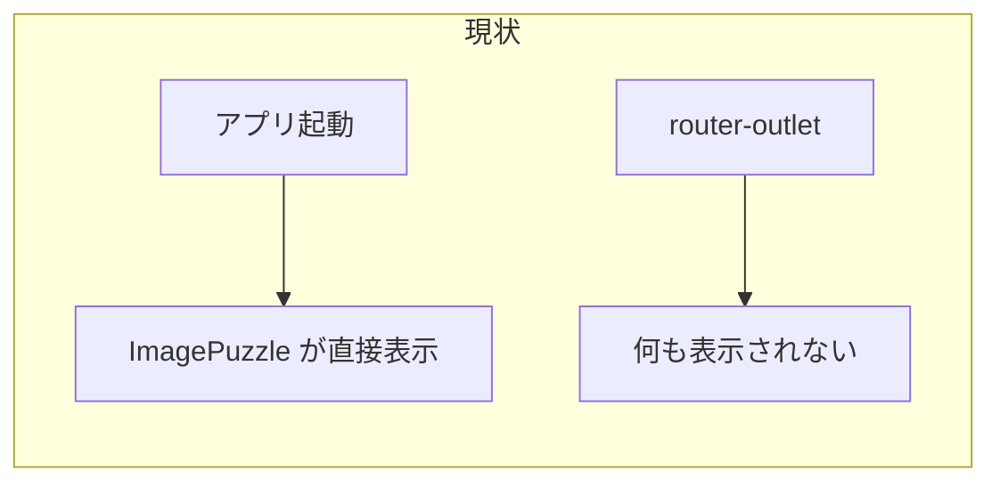
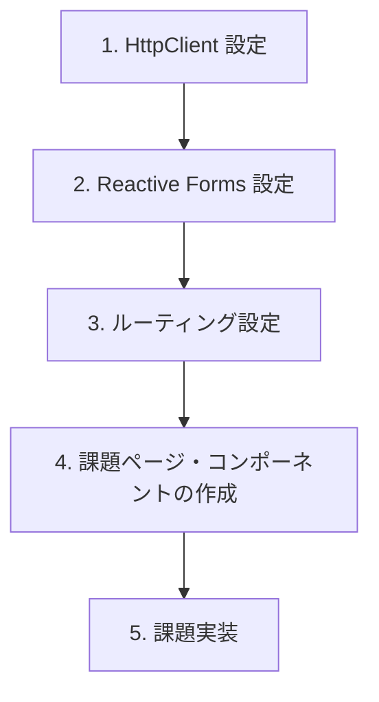

# 課題実施前に不足しているもの

## 概要

| カテゴリ | 状態 |
|----------|------|
| RxJS | ✅ 既に入っている (7.8.0) |
| ルーティング | ❌ 未設定 (routes が空) |
| 課題ページ | ❌ 未実装 |
| HTTP クライアント | ❌ 未設定 |
| Reactive Forms | ❌ 未設定 |

---

## あなたのリストと現状

### 1. ルートページから課題ページへの遷移

**現状**: `app.routes.ts` が空でルート未定義



**必要な対応**:
- ルート定義の追加（例: `/` → パズル、`/assignment` → 課題）
- ルートページに課題へのリンク追加

---

### 2. 既存実装の RxJS 置き換え

**現状**: `ImagePuzzleComponent` は **Signal** ベース（`signal()`, `computed()`）

- 課題は **RxJS + Observable** が前提
- ImagePuzzle は課題対象外なので、**置き換え不要**の可能性が高い
- 課題用の新規コンポーネントは最初から RxJS で実装する想定

---

### 3. RxJS を入れる

**現状**: ✅ **既に入っている**

```json
"rxjs": "~7.8.0"
```

追加インストールは不要。

---

## 課題で必要な追加項目

### 4. HttpClient の設定

API 呼び出し（`/users`, `/posts?userId=xx`）に必要。

```typescript
// app.config.ts に追加
import { provideHttpClient } from '@angular/common/http';

providers: [
  provideHttpClient(),
  // ...
]
```

---

### 5. Reactive Forms の設定

課題3の検索フィルタで `FormControl` を使うため必要。

```typescript
// app.config.ts に追加
import { provideReactiveForms } from '@angular/forms';

providers: [
  provideReactiveForms(),
  // ...
]
```

または、課題用コンポーネントで `ReactiveFormsModule` を import する方法でも可。

---

### 6. 課題用のディレクトリ・コンポーネント構成

現在は課題用のコンポーネントやページが存在しない。

**例**:
- `src/app/features/user-search/` または `src/app/pages/assignment/`
- `User`, `Post` の型定義
- 課題用のサービス（API 呼び出し）

---

### 7. takeUntilDestroyed の利用

課題7で `subscribe` を極力書かず、書く場合は `takeUntilDestroyed` を使う条件。

- Angular 16+ で利用可能（本プロジェクトは Angular 20）
- `DestroyRef` の注入が必要（`inject(DestroyRef)` またはコンストラクタインジェクション）

---

## 作業の優先度（推奨順）



| 優先度 | 項目 | 理由 |
|--------|------|------|
| 1 | HttpClient | 課題1から必須 |
| 2 | Reactive Forms | 課題3で FormControl が必要 |
| 3 | ルーティング | 課題ページへの遷移用 |
| 4 | 課題コンポーネント構成 | 実装の土台 |
| 5 | RxJS 置き換え | 既存パズルはそのままで可 |

---

## 補足

- **Angular バージョン**: 課題は「Angular 21」、プロジェクトは Angular 20。課題の API は互換性が高い想定。
- **既存パズル**: 課題と別機能のため、Signal のまま維持で問題なし。
